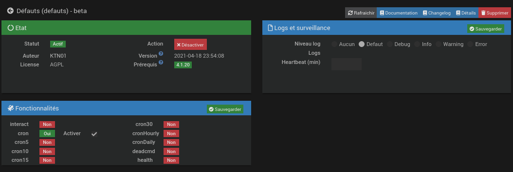
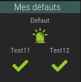
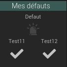
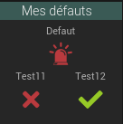
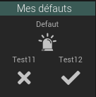
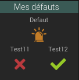
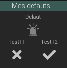
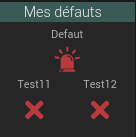
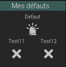
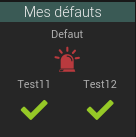

#  Documentation du plugin Défauts 

Le plugin **Défauts** permet de détecter des défauts en vérifiant la cohérence entre un état et une mesure.
# Quelques exemples:
- une lampe allumée mais pas de consommation (ampoule défectueuse ou mauvais signal de retour).
- Une lampe éteinte mais consomation de plus de 1 watt (mauvais état de retour).
- Une pompe enclenchée mais pas de débit.

# Configuration du plugin
Le plugin ne nécessite aucune configuration, il faut juste l’activer.

# Les équipements
Un équipement **Défauts** permet de surveiller la cohérence de plusieurs combinaisons d'état et de valeur. Une info
indique pour chacune de ces surveillances si la situation actuelle est cohérente ou non.

De plus, une info **défaut** est activée lorsqu'une surveillance détecte une incohérence. Cette info reste activée
jusqu'à ce qu'elle soit acquittée même si l'incohérence disparaît.

## Création
Les équipements **Défauts** sont créés sur la page du plugin qui est atteignable via le menu `plugins`==> `Monitoring` ==> `Défauts`.
L'équipement est créé avec deux commandes:
+ Une commande **defaut**, de type info, qui inquique si une incohérence est ou a été détectée par une des surveillances de l'équipement.
+ Une commande **Acquittement**, de type action, pour acquitter les défauts détectés.

## Configuration
### De l'équipement
Outre les configurations habituelles, l'équipement a deux paramêtres permettant de définir le fonctionnement de l'*Auto acquittement*:
* *Auto Acquittement*   
   indique si les défauts doivent être acquittés automatiqeuement ou non.
* *Délais* *(visible uniquement su l'auto acquittement est activé)*  
   Le délais d'attente
   
### Des surveillances
Le panneau `surveillances` permet de géger les surveillances de l'équipement. Le bouton "Ajouter une surveillance" ajoute une surveillance à l'équipement.

Les surveillances ont plusieurs paramêtres:
* **nom**  
  Nom de la surveillance
* **Etat**  
  Info binaire à surveiller
* **Mesure**
  Info numérique à surveiller
* **Limite**  
  Valeur dant être atteinte pas le mesure lorsque l'état est à 1 (incohérence si cette valeur n'est pas atteinte.  
  Il y a aussi incohérence si cette valeur est atteinte alors que l'état est à 0.
* **Temporisation**  
  Délais pour atteindre la limite après changement d'état.
* **Inverser**  
  Inversion de la surveillance. Lamesure doit être supérieure à la limite lorsque l'état est à 0.
* **En**  
  Surveillance active lorsque l'état est à 1
* **Hors**  
  Surveillance active lorsque l'état est à 0
* **Afficher**  
  Affichage de l'info
* **Affichage inversé**
  In versionde la valeur pour l'affichage (permet d'avoir une icône verte si tout va bien et rouge en cas de défaut).
* **Historiser**  
  Historisation de 'info

## Exemple

| Etape | Widget de l'équipement (couleur) | Widget de l'équipement (noir/blanc) | Observations |
| :---- | :----:  | :----: | :---- |
| Situation de départ: |  |  | Pas de défaut, Les surveillances sont en état normal. |
| 1ière surveillance en en état anormal |  |  | L'icône de défaut indique qu'il y a eu une anomalie qui n'a pas été acquittée. |
| Acquittement du défaut |  |  | Le défaut a été acquitté pas un clic sur l'icône (ou par l'auto-acquittement). L'Icône de défaut indique que l'anomalie est toujours présente. |
| 2ième anomalie | |  | L'icône de défaut indqieu qu'il y a une nonvelle anomalie. |
| Disparition des anomalies | |  | L'icône de défaut indqieu qu'il y a eu au mois uneanolalie qui n'a pas été acquittée. |
| Retour à la normale: |  |  | Les anomalies ont été aquittées et ont disparues. |
